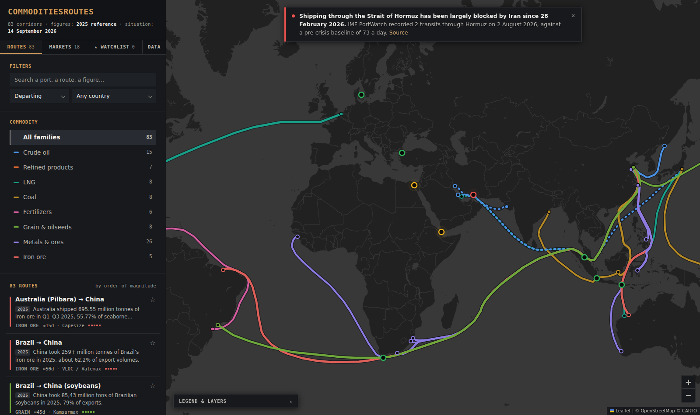
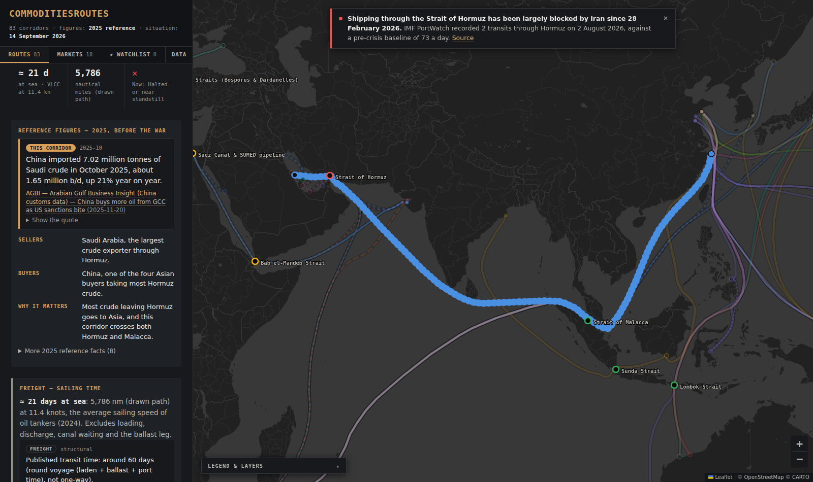
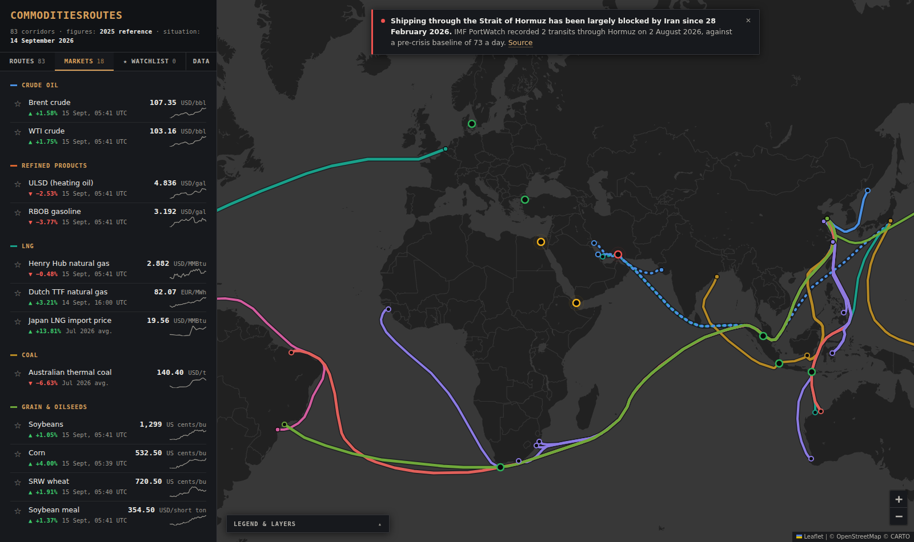

# CommodityFlow

**A self-built atlas of the world's main seaborne commodity trades — who ships what to
whom, through which straits, on which ships, and what changed when the Strait of Hormuz
closed.**



## Why this map exists

I built this map to train myself on physical commodity flows. Price screens show that oil,
LNG, iron ore or soybeans move, but not *where the cargoes actually go*. To understand a
market, you need to know:

- **Who sells and who buys**: Saudi crude to China, Pilbara iron ore to Chinese mills,
  US LNG to Europe, Brazilian soybeans to China…
- **Which chokepoints a cargo must pass**: Hormuz, Malacca, Suez, Bab el-Mandeb, Panama,
  the Cape of Good Hope…
- **Which vessels do the work, and how long a voyage takes.**
- **What happens when a route breaks**: since 28 February 2026, the closure of the Strait
  of Hormuz has turned a textbook chokepoint into a live case study.

Reading reports gave me figures; drawing every corridor, one by one, forced me to check
where each figure applies. The value of this project is the output — the map and its
dataset — not the code.

## What you can read on the map

| | |
|---|---|
| **83 corridors** | 8 families: crude oil, refined products, LNG, coal, iron ore, grain & oilseeds, metals & ores (base metals and critical minerals), fertilizers |
| **Trading context** | For each route, in three lines: the selling country, the buying country, and why the route matters |
| **Sailing time** | Typical vessel class (VLCC, Capesize, LNG carrier…), sea distance, and estimated days at sea, next to published transit times |
| **10 chokepoints** | Volumes that pass through each one, and the routes that depend on it |
| **Two periods, never mixed** | 2025 reference figures (before the war) in one block; the current status of each corridor (normal, reduced, rerouted, halted) in another |
| **AI market brief** | A panel on the right of the map with the commodity and geopolitical news of the last 24 hours, summarised by an AI agent, each item linked to its articles |
| **18 market prices** | Brent, WTI, TTF, Henry Hub, Japan LNG, coal, iron ore, copper, soybeans, wheat…, refreshed automatically |
| **Watchlist** | Star routes and prices, and show only those on the map |



## A few things the map taught me

Every figure below comes from the dataset and links to its source.

- **Malacca, not Hormuz, is the largest oil chokepoint.** About 23.2 Mb/d of oil went
  through Malacca in H1 2025, against 20.9 Mb/d through Hormuz
  ([EIA](https://www.eia.gov/international/content/analysis/special_topics/World_Oil_Transit_Chokepoints)).
- **Oil was already going around Africa before 2026.** About 9.1 Mb/d went around the Cape of
  Good Hope in H1 2025, 3 Mb/d more than in 2022
  ([EIA](https://www.eia.gov/international/content/analysis/special_topics/World_Oil_Transit_Chokepoints)).
  For Gulf crude bound for Europe, that means a published transit of nearly 35 days via
  the Cape against 19 days via Suez
  ([EIA](https://www.eia.gov/todayinenergy/detail.php?id=61363)).
- **Hormuz today is almost empty.** IMF PortWatch recorded 2 transits through Hormuz on
  2 August 2026, against a pre-crisis baseline of 73 a day
  ([straits.live, compiling IMF PortWatch](https://straits.live/briefs/2026-08-08)).
- **Iron ore is an Australian trade.** Australia shipped 695.55 million tonnes in
  Q1–Q3 2025, 55.77% of seaborne supply
  ([AXSMarine](https://public.axsmarine.com/blog/iron-ore-flows-2025)). Pilbara to China
  takes an estimated 15 days at sea on a Capesize; Brazil to China, about 50 on a Valemax.
- **US soybeans face a routing choice.** A laden Panamax from the US Gulf to Qingdao
  takes roughly 40 days via Panama and 61 via the Cape
  ([Breakwave Advisors](https://www.breakwaveadvisors.com/insights/2025/11/19/us-soybean-and-panama-canal-dynamics)).



## How the data is built and kept up to date

**One rule: nothing without a source.** Each of the **359 facts** (from **169 sources**:
EIA, IEA, IMF, Kpler, Drewry, national statistics, trade press…) carries a link and the
*verbatim sentence* it was taken from. A figure that does not appear in its quote is
rejected automatically. When a source could not be found, the map says "not sourced yet"
rather than guessing.

**An AI agent for freight research.** Vessel classes, sea distances and transit times are
collected by a dedicated AI agent, [`freight-analyst`](.claude/agents/freight-analyst.md)
(a Claude Code subagent). For each route, it searches official and industry sources, saves
the pages it read and returns every value with its verbatim quote — or "not found". I
review each row; scripts then check every quote and figure before anything reaches the
map. Uncited aggregators are excluded.

**An AI agent for the daily news.** Every two hours, a GitHub Actions workflow collects
the last 24 hours of public headlines (shipping, energy, metals and agri trade press, and
Google News searches on Hormuz, OPEC, sanctions, the Red Sea…) and asks Claude (Haiku 4.5)
to write a short brief. A validator then removes any item that cites no headline or quotes a
number its headlines do not contain. The panel says it is AI-generated, links every item to
its articles, and shows when a brief is out of date.

**Automated market prices.** A GitHub Actions workflow runs every 30 minutes on weekdays
and fetches 18 prices (Yahoo Finance futures, IMF monthly prices via FRED). The site picks
them up without being rebuilt. Stale or failed prices are flagged, never shown as fresh.

**Automated checks.** Before each publication, scripts verify that:

- every fact is backed by its quote;
- the two periods (2025 reference, current situation) are kept apart;
- no route crosses land;
- each route passes through the chokepoints it declares.

A separate script re-downloads every source page and looks for each quote.

## Coverage and limits

- **Freight coverage is partial.** 62 of 83 routes have a sourced vessel class, and
  therefore an estimated sailing time. 19 have a published transit time, and 10 a
  published sea distance. The others use the length of the line drawn on the map, and
  say so.
- **Estimated days at sea** = distance ÷ fleet-average speed. They exclude port time,
  canal waiting and the return (ballast) leg.
- **Ports are sometimes representative.** When a source only reports a country-level
  flow, the port drawn stands for the country, and the route card says so.
- **Line thickness** is an order of magnitude from 1 to 5, not a measurement.
- **The news brief is a reading aid, not verified data.** It summarises headlines only
  (the articles themselves are not read) and never enters the dataset.
- **Market prices are indicative.** They are delayed and are exchange benchmarks, not
  physical delivered prices.

## Repository

```
data/                  the dataset: sources, facts, routes, chokepoints, vessels (CSV, editable)
.claude/agents/        the freight research agent
.github/workflows/     automated price and news updates
scripts/               data checks, the price fetcher and the news brief builder
src/                   the web app (React + Leaflet)
docs/                  technical notes and screenshots
```

- **Data dictionary and editing rules:** [`data/README.md`](data/README.md).
- **Running, checking and deploying the site:** [`docs/TECHNICAL.md`](docs/TECHNICAL.md).
